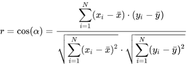

# 1 Preparación del conjunto de datos

## 1.1 Cargar el archivo de datos

```{r}
library(readxl)

df <- read_excel("sleephealth.xlsx")
head(df)
```

## 1.2 Nombres de las columnas

```{r}
colnames(df)[colnames(df) == "Person.ID"] <- "ID"
colnames(df)[colnames(df) == "Sleep.Duration"] <- "SH"
colnames(df)[colnames(df) == "Quality.of.Sleep"] <- "SQ"
colnames(df)[colnames(df) == "Physical.Activity.Level"] <- "PHY"
colnames(df)[colnames(df) == "Stress.Level"] <- "Stress"
colnames(df)[colnames(df) == "BMI.Category"] <- "BMI"
colnames(df)[colnames(df) == "Blood.Pressure"] <- "BP"
colnames(df)[colnames(df) == "Heart.Rate"] <- "HR"
colnames(df)[colnames(df) == "Daily.Steps"] <- "Steps"
colnames(df)[colnames(df) == "Sleep.Disorder"] <- "SD"


colnames(df)
```

# 2 Normalización de formatos en variables categóricas

Antes de proceder con la limpieza, se revisaron los valores únicos de las variables categóricas:

```{r}
list(
  Gender = unique(df$Gender),
  Occupation = unique(df$Occupation),
  BMI = unique(df$BMI),
  SleepDisorder = unique(df$`SD`) 
)
```

- En `Occupation`, se detectaron inconsistencias como `"engineer"` (minúscula), y categorías redundantes como `"Salesperson"` y `"Sales Representative"`, que hacen referencia al mismo rol. Se unificaron bajo `"Sales"`.
- En `BMI`, se encontraron las categorías `"Normal"` y `"Normal Weight"`, que también se unificaron como `"Normal"`.
- Las variables `Gender` y `SleepDisorder` no presentaron inconsistencias.

Tras esta revisión, se aplicaron transformaciones para estandarizar el formato: eliminación de espacios (`str_trim()`), capitalización (`str_to_title()`), y conversión a factor.

A continuación se muestra el código utilizado:

```{r}
library(dplyr)
library(stringr)  

# -------------------------------
# Normalizar Occupation
# -------------------------------
df$Occupation <- df$Occupation %>%
  str_trim() %>%
  str_to_lower() %>%
  str_to_title()

df$Occupation[df$Occupation %in% c("Sales Representative", "Salesperson")] <- "Sales"
df$Occupation <- as.factor(df$Occupation)

# -------------------------------
# Normalizar BMI
# -------------------------------
df$BMI <- df$BMI %>%
  str_trim() %>%
  str_to_lower() %>%
  str_to_title()

df$BMI[df$BMI %in% c("Normal", "Normal Weight")] <- "Normal"
df$BMI <- as.factor(df$BMI)

# -------------------------------
# Normalizar Sleep Disorder (SD)
# -------------------------------
df$SD <- df$SD %>%
  str_trim() %>%
  str_to_lower() %>%
  str_to_title() %>%
  as.factor()

df$Gender <- as.factor(df$Gender)
df$SD <- as.factor(df$SD)


list(
  Gender = levels(df$Gender),
  Occupation = levels(df$Occupation),
  BMI = levels(df$BMI),
  SleepDisorder = levels(df$SD)
)

```

# 3 Inconsistencias en variables cuantitativas

```{r}
str(df)
```

Se detectó que las columnas `Age` y `SH` estaban tipadas como texto (`character`) en lugar de numéricas. Se corrigió este error mediante su conversión a tipo `numeric`.

Además, la variable `BP`, que contenía la presión arterial como texto en formato `"sistólica/diastólica"`, fue separada en dos columnas independientes de tipo numérico: `BPsyst` y `BPdias`.

Las demás variables numéricas (`SQ`, `PHY`, `Stress`, `HR`, `Steps`) ya estaban correctamente tipadas.

Los valores no numéricos o vacíos en estas columnas han sido transformados automáticamente a `NA` como resultado de las conversiones.


```{r}
library(dplyr)
library(stringr)

# Convertir columnas mal tipadas a numéricas
df <- df %>%
  mutate(
    Age = as.numeric(Age),
    SH = as.numeric(SH)
  )

# Separar presión arterial en dos columnas numéricas 
df <- df %>%
  mutate(
    BPsyst = as.numeric(str_extract(BP, "^\\d+")),
    BPdias = as.numeric(str_extract(BP, "(?<=/)\\d+"))
  )

# Eliminar la columna BP original 
df <- df %>%
  select(-BP)

str(df)
summary(select(df, Age, SH, SQ, PHY, Stress, HR, Steps, BPsyst, BPdias))

```

# 4. Valores erróneos o atípicos

## 4.1 Valores erróneos

Se revisaron los valores de las variables numéricas y se identificaron datos erróneos según límites fisiológicos o lógicos. Por ejemplo, se detectó un valor de edad igual a 999, lo cual es inviable, y se sustituyó por `NA`. También se aplicaron las siguientes reglas para asegurar que en posibles futuros datos se eliminen estos valores erroneos:

- Edad debe estar entre 0 y 120 años.
- Horas de sueño entre 0 y 24.
- Calidad del sueño y nivel de estrés en el rango [1, 10].
- Presión arterial y frecuencia cardíaca dentro de rangos fisiológicos.

Los valores que no cumplieron estos criterios fueron transformados en `NA`.

```{r}
df <- df %>%
  mutate(
    Age = ifelse(Age < 0 | Age > 120, NA, Age),
    SH = ifelse(SH < 0 | SH > 24, NA, SH),
    SQ = ifelse(SQ < 1 | SQ > 10, NA, SQ),
    Stress = ifelse(Stress < 1 | Stress > 10, NA, Stress),
    PHY = ifelse(PHY < 0 | PHY > 1440, NA, PHY),
    HR = ifelse(HR < 30 | HR > 200, NA, HR),
    Steps = ifelse(Steps < 0, NA, Steps),
    BPsyst = ifelse(BPsyst < 50 | BPsyst > 250, NA, BPsyst),
    BPdias = ifelse(BPdias < 30 | BPdias > 150, NA, BPdias)
  )
```


## 4.2 Valores atípicos

```{r}
summary(select(df, Age, SH, SQ, PHY, Stress, HR, Steps, BPsyst, BPdias))
```

Se analizaron los valores atípicos mediante el método del rango intercuartílico (IQR) aplicado a las variables cuantitativas. Tras observar los valores mínimos, máximos y los cuartiles, se concluyó que todos los valores se encuentran dentro de rangos razonables, tanto a nivel estadístico como fisiológico.

En consecuencia, no fue necesario eliminar ningún valor como atípico.

# 5. Imputación

```{r}
colSums(is.na(df[, c("Age", "SH", "SQ", "Stress", "PHY", "HR", "Steps", "BPsyst", "BPdias")]))

```

Se detectaron valores faltantes únicamente en las variables `Age` (9 casos) y `SH` (2 casos).  
Para completar estos valores, se utilizó el método de imputación por k vecinos más cercanos (k = 3), mediante la función `kNN()` del paquete `VIM`.


```{r}
library(VIM)

# Imputamos solo Age y SH con k = 3
df_imputed <- kNN(df, variable = c("Age", "SH"), k = 3, imp_var = TRUE)

# Mostrar las filas donde se imputó Age o SH
df_imputed[which(df_imputed$Age_imp | df_imputed$SH_imp),
           c("ID", "Age", "Age_imp", "SH", "SH_imp")]


```

```{r}
colSums(is.na(df_imputed[, c("Age", "SH", "SQ", "Stress", "PHY", "HR", "Steps", "BPsyst", "BPdias")]))
```

# 6. Correlaciones

## 6.1 Matriz de correlaciones

Se calculó la matriz de correlaciones de Pearson entre las variables numéricas. A continuación se muestran los resultados redondeados:

```{r}

numeric_vars <- df_imputed[, c("Age", "SH", "SQ", "PHY", "Stress", "HR", "Steps", "BPsyst", "BPdias")]

# Calculamos la matriz de correlaciones de Pearson
cor_matrix <- cor(numeric_vars)

round(cor_matrix, 2)

```

Interpretación de resultados:

  - Se observa una fuerte correlación positiva entre SH (Sleep Hours) y SQ (Sleep Quality), lo cual indica que más horas de sueño se relacionan con una mejor calidad.

  - Stress muestra una alta correlación negativa con SQ, lo que concuerda con la intuición: más estrés implica peor calidad del sueño.

  - Las variables BPsyst y BPdias están fuertemente correlacionadas (r = 0.97), como es habitual en medidas de presión arterial.

  - También hay una correlación moderada entre Age y la presión arterial.
  
  
## 6.2 Cálculo de correlaciones

Se implementó manualmente la fórmula de la correlación de Pearson entre dos variables numéricas:



Esta fórmula calcula la covarianza entre las dos variables dividida por el producto de sus desviaciones estándar. A partir de ella se construyó la siguiente función en R:

```{r}
cor_pearson <- function(x, y) {
  x <- as.numeric(x)
  y <- as.numeric(y)
  
  x_mean <- mean(x)
  y_mean <- mean(y)
  
  numerator <- sum((x - x_mean) * (y - y_mean))
  
  denominator <- sqrt(sum((x - x_mean)^2) * sum((y - y_mean)^2))
  
  r <- numerator / denominator
  return(r)
}

```

Se comparó el resultado de la función con el resultado nativo de R:

```{r}
manual <- cor_pearson(df_imputed$SH, df_imputed$SQ)
builtin <- cor(df_imputed$SH, df_imputed$SQ)

manual
builtin

```
Ambos resultados coinciden, validando la implementación.

# 7. Análisis descriptivo y visual

## 7.1 Tabla resumen de tendencia central y variabilidad de HR según SD (Sleep Disorder)

Se calculó la media y la desviación estándar de las variables `SH`, `SQ`, `HR` y `Stress`, agrupadas según el tipo de trastorno del sueño (`SD`). Esto permite observar diferencias entre personas con y sin trastornos como insomnio o apnea del sueño.

```{r}
library(dplyr)
library(kableExtra)

tabla_resumen <- df_imputed %>%
  group_by(SD) %>%
  summarise(
    SH_media = mean(SH, na.rm = TRUE),
    SH_sd = sd(SH, na.rm = TRUE),
    
    SQ_media = mean(SQ, na.rm = TRUE),
    SQ_sd = sd(SQ, na.rm = TRUE),
    
    HR_media = mean(HR, na.rm = TRUE),
    HR_sd = sd(HR, na.rm = TRUE),
    
    Stress_media = mean(Stress, na.rm = TRUE),
    Stress_sd = sd(Stress, na.rm = TRUE)
  )

tabla_resumen %>%
  kable(digits = 2, caption = "Resumen estadístico por tipo de trastorno del sueño") %>%
  kable_styling(full_width = FALSE)

```

La tabla muestra cómo varían las medidas de sueño, frecuencia cardíaca y estrés según el tipo de trastorno del sueño (`SD`):

  - Las personas con insomnio presentan menos horas de sueño, peor calidad, mayor frecuencia cardíaca y más estrés.

  - En el caso de sleep apnea, aunque las horas de sueño son similares a las personas sin trastorno, la calidad del sueño y la frecuencia cardíaca se ven afectadas.

  - Las personas sin trastorno obtienen los mejores resultados en todas las métricas, como era esperable.

Estos resultados reflejan el impacto negativo que los trastornos del sueño tienen sobre la salud general y el bienestar.


## 7.2 Gráfico de medias según HR y Occupation

```{r}
library(ggplot2)

df_plot <- df_imputed %>%
  group_by(SD, Occupation) %>%
  summarise(HR_media = mean(HR, na.rm = TRUE), .groups = "drop")

df_plot$SD <- factor(df_plot$SD, levels = c("None", "Insomnia", "Sleep Apnea"))

ggplot(df_plot, aes(x = SD, y = HR_media, group = Occupation, color = Occupation)) +
  geom_line(size = 1) +
  geom_point(size = 2) +
  labs(
    title = "Media de HR según tipo de trastorno del sueño y ocupación",
    x = "Trastorno del sueño (SD)",
    y = "Frecuencia cardíaca media (HR)"
  ) +
  theme_minimal()

```
Se observa cómo la frecuencia cardíaca media varía en función del tipo de trastorno del sueño (`SD`) y según la ocupación. Algunas profesiones como `Software Engineer` presentan picos de HR elevados ante casos de `Insomnia`, lo que podría estar relacionado con el estrés o la carga mental del trabajo.

Este gráfico permite visualizar de forma clara la relación entre ocupación, calidad del sueño y frecuencia cardíaca, lo que puede ser útil para análisis posteriores de bienestar y salud laboral.


```{r}
write.csv(df_imputed, "sleephealth_processed.csv", row.names = FALSE)

```

